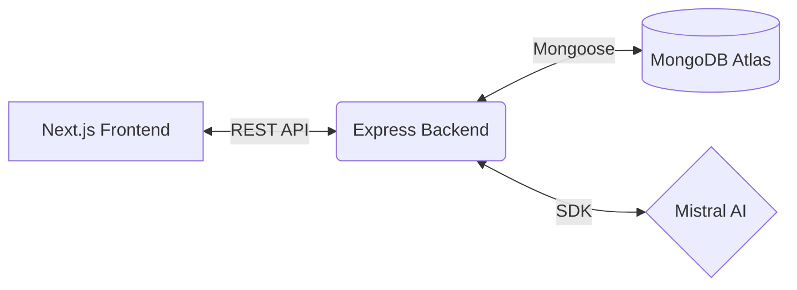

# 🛡️ ReeRoute: AI-Powered Customer Support Dashboard

[](https://nextjs.org/)
[](https://nodejs.org/)
[](https://mongodb.com/)
[](https://mistral.ai/)
[](https://opensource.org/licenses/ISC)

> **ReeRoute** is a modern, AI-assisted support operations platform designed to empower customer service teams.

Built for the Full Stack Engineering Assignment, this dashboard allows support agents to manage tickets, track conversations, and leverage advanced AI-powered workflows to resolve customer issues efficiently while maintaining human-in-the-loop oversight.

## 🏗️ Tech Stack

| Layer | Technology | Purpose |
|-------|-----------|---------|
| **Frontend** | Next.js 16 + TailwindCSS 4 | Server-side rendered React dashboard with modern minimal UI |
| **Backend** | Node.js + Express 5 | RESTful API using layered monolithic architecture |
| **Database** | MongoDB + Mongoose 9 | Document store with advanced indexing and text search |
| **AI Engine** | Mistral AI | Core AI capabilities (Summarization, categorization, sentiment, escalation) |
| **Validation** | Zod v4 | Strict schema-based request and environment validation |
| **Security** | Helmet + Rate Limit | HTTP hardening and robust API rate limiting |



## ✨ Key Features

### Ticket Management
- **Full CRUD** — Create, view, update, and manage support tickets
- **Advanced Filtering** — Filter by status, priority, category, sentiment, and escalation state
- **Full-Text Search** — Debounced search across ticket titles, customer names, and tags
- **Pagination** — Server-side pagination with configurable page sizes (max 100/page)
- **Activity Timeline** — Every action (status change, note, AI action) is logged chronologically

### AI-Powered Workflows
- **🧠 Ticket Summarization** — AI generates concise 2-3 sentence summaries of long conversations
- **💬 Suggested Replies** — Context-aware response drafting based on full conversation history
- **📊 Sentiment Analysis** — Auto-detects customer mood (positive/neutral/negative) on each message
- **🏷️ Issue Categorization** — AI classifies tickets (billing, technical, shipping, account, general) with confidence scores
- **🔍 Similar Ticket Discovery** — Finds related tickets to surface past solutions
- **🚨 Escalation Recommendations** — AI analyzes urgency and recommends escalation with reasoning

### Support Operations
- **Internal Notes** — Agents can add private notes invisible to customers
- **Dashboard Statistics** — Real-time aggregated counts by status, priority, sentiment
- **Smart Escalation** — Auto-escalates urgent tickets with negative sentiment

---

## 🚀 Getting Started

### Prerequisites
- Node.js 18+ 
- MongoDB instance (local or Atlas)
- Mistral AI API key

### Installation

```bash
# Clone the repository
git clone <repository-url>
cd ReeRoute-Support

# ─── Backend Setup ───────────────────────────────────
cd backend
npm install

# Configure environment
cp .env.example .env
# Edit .env with your MongoDB URI and Mistral API key

# Seed the database with 100 realistic tickets
npm run seed

# Start backend (development)
npm run dev

# ─── Frontend Setup ──────────────────────────────────
cd ../frontend
npm install

# Configure environment
cp .env.example .env.local
# Edit .env.local with your backend API URL

# Start frontend (development)
npm run dev
```

### Environment Variables

#### Backend (`backend/.env`)

```env
PORT=8080
MONGO_URI=your_mongodb_connection_string
MISTRAL_API_KEY=your_mistral_api_key
NODE_ENV=development
# FRONTEND_URL=https://your-app.vercel.app  (production only)
```

#### Frontend (`frontend/.env.local`)

```env
NEXT_PUBLIC_API_URL=http://localhost:8080/api
```

---

## 🌐 Deployment

### Frontend → Vercel
1. Push code to GitHub
2. Connect repo to [Vercel](https://vercel.com)
3. Set root directory to `frontend`
4. Add environment variable: `NEXT_PUBLIC_API_URL` = your Render backend URL
5. Deploy

### Backend → Render
1. Connect repo to [Render](https://render.com)
2. Create a new **Web Service**
3. Set root directory to `backend`
4. Build command: `npm install`
5. Start command: `npm start`
6. Add environment variables: `MONGO_URI`, `MISTRAL_API_KEY`, `NODE_ENV=production`, `FRONTEND_URL`
7. Set health check path: `/api/health`

---

## 📡 API Reference

### Base URL
```
http://localhost:8080/api
```

### Health Check
```
GET /api/health → { status: 'ok', database: 'connected', uptime: '120s' }
```

### Tickets

| Method | Endpoint | Description |
|--------|----------|-------------|
| `GET` | `/tickets` | List tickets (paginated, filterable) |
| `GET` | `/tickets/stats` | Dashboard statistics |
| `POST` | `/tickets` | Create a new ticket |
| `GET` | `/tickets/:id` | Get ticket detail with messages |
| `PATCH` | `/tickets/:id` | Update ticket (status, priority, etc.) |
| `POST` | `/tickets/:id/notes` | Add internal note |
| `POST` | `/tickets/:id/messages` | Add conversation message |

#### Query Parameters for `GET /tickets`

| Param | Type | Example | Description |
|-------|------|---------|-------------|
| `status` | string | `open` | Filter by status (open, in-progress, resolved, closed) |
| `priority` | string | `high` | Filter by priority (low, medium, high, urgent) |
| `category` | string | `billing` | Filter by category |
| `sentiment` | string | `negative` | Filter by sentiment |
| `escalated` | boolean | `true` | Filter escalated tickets |
| `q` | string | `refund` | Full-text search |
| `sortBy` | string | `createdAt` | Sort field |
| `sortOrder` | string | `desc` | Sort direction (asc/desc) |
| `page` | number | `1` | Page number |
| `limit` | number | `20` | Items per page (max 100) |

### AI Features

| Method | Endpoint | Description |
|--------|----------|-------------|
| `POST` | `/tickets/:id/ai/summary` | Generate AI summary |
| `POST` | `/tickets/:id/ai/reply` | Generate suggested reply |
| `POST` | `/tickets/:id/ai/categorize` | AI categorization with confidence |
| `POST` | `/tickets/:id/ai/similar` | Find similar tickets |
| `POST` | `/tickets/:id/ai/escalation` | Escalation recommendation |

---

## 📂 Project Structure

```
ReeRoute-Support/
├── README.md
├── PRODUCT_DECISIONS.md
├── ARCHITECTURE.md
├── AI_USAGE_REPORT.md
│
├── backend/
│   ├── server.js                    # Entry point, graceful shutdown
│   ├── package.json
│   ├── .env.example
│   └── src/
│       ├── app.js                   # Express app config, middleware stack
│       ├── config/
│       │   ├── ai.js                # Mistral AI client initialization
│       │   ├── db.js                # MongoDB connection
│       │   └── env.js               # Environment validation (Zod)
│       ├── controllers/
│       │   ├── ticketController.js   # Ticket HTTP handlers
│       │   └── aiController.js       # AI feature HTTP handlers
│       ├── dao/
│       │   ├── ticketDao.js          # Ticket database operations
│       │   └── messageDao.js         # Message database operations
│       ├── middlewares/
│       │   ├── errorHandler.js       # Global error handling
│       │   └── validateRequest.js    # Zod schema validation
│       ├── models/
│       │   ├── Ticket.js             # Ticket Mongoose schema
│       │   └── Message.js            # Message Mongoose schema
│       ├── routes/
│       │   ├── index.js              # Route aggregator + health check
│       │   └── ticketRoutes.js       # Ticket + AI route definitions
│       ├── scripts/
│       │   └── seed.js               # Database seeder (100 tickets)
│       ├── services/
│       │   ├── ticketService.js      # Business logic orchestration
│       │   └── aiService.js          # Mistral AI integration
│       ├── utils/
│       │   ├── apiError.js           # Custom error class
│       │   └── asyncHandler.js       # Async route wrapper
│       └── validators/
│           └── ticketValidator.js    # Zod request schemas
│
└── frontend/
    ├── package.json
    ├── .env.example
    ├── next.config.mjs
    └── src/
        ├── app/
        │   ├── layout.js             # Root layout with Inter font
        │   ├── globals.css            # TailwindCSS imports
        │   └── page.js               # Main dashboard page
        ├── components/
        │   ├── dashboard/
        │   │   ├── TicketList.js       # Filterable ticket inbox
        │   │   ├── TicketCard.js       # Individual ticket card
        │   │   ├── TicketDetail.js     # Full ticket detail view
        │   │   ├── ConversationView.js # Message thread + AI drafts
        │   │   ├── AIAssistancePanel.js# AI copilot panel
        │   │   ├── InternalNotesView.js# Private agent notes
        │   │   ├── ActivityLogView.js  # Activity timeline
        │   │   └── StatsOverview.js    # KPI cards
        │   └── ui/
        │       ├── Badge.js            # Status/priority badges
        │       ├── Button.js           # Button variants
        │       ├── Card.js             # Card container
        │       ├── Input.js            # Text input
        │       ├── Select.js           # Dropdown select
        │       └── Textarea.js         # Text area
        ├── hooks/
        │   └── useTickets.js          # React Query hooks
        ├── lib/
        │   └── api.js                 # API client
        └── providers/
            └── QueryProvider.js       # React Query provider
```

---

## 📄 Documentation

- [Product Decisions](./PRODUCT_DECISIONS.md) — Feature rationale, tradeoffs, and future roadmap
- [Architecture Notes](./ARCHITECTURE.md) — System design, database schema, AI pipeline, scalability
- [AI Usage Report](./AI_USAGE_REPORT.md) — How AI tools were used in development and the product

---

## 📝 License

ISC
